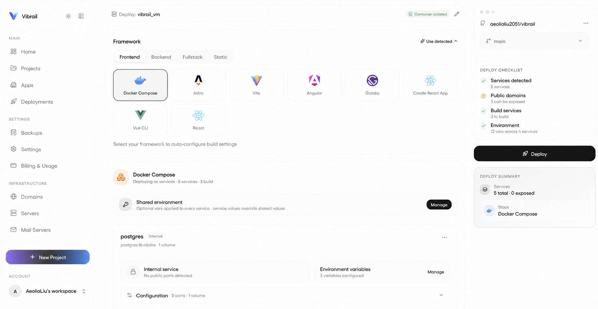

<h1 align="center">Vibrail</h1>

<p align="center">
  Open-Source-Deployment-Plattform zum Selbsthosten mit integriertem CI/CD.<br>
  Code pushen, Container ausliefern, Infrastruktur verwalten — über eine Desktop-App, ein Web-Dashboard oder die CLI.
</p>

<p align="center">
  <a href="https://www.npmjs.com/package/@vibrail/cli"></a>
  <a href="../../LICENSE"></a>
  <a href="https://vibrail.warpgateapi.com"></a>
</p>

<p align="center">
  <a href="#schnellstart">Schnellstart</a> ·
  <a href="#funktionen">Funktionen</a> ·
  <a href="#drei-oberflächen">Oberflächen</a> ·
  <a href="https://docs.vibrail.warpgateapi.com/">Dokumentation</a> ·
  <a href="../../CONTRIBUTING.md">Mitwirken</a>
</p>

<p align="center">
  <a href="../../README.md"></a>
  <a href="README.ar.md"></a>
  <a href="README.zh.md"></a>
  <a href="README.es.md"></a>
  <a href="README.fr.md"></a>
  <a href="README.ja.md"></a>
  <a href="README.pt.md"></a>
  <a href="README.de.md"></a>
  <a href="README.tr.md"></a>
</p>

<p align="center">
  
</p>

---

## Schnellstart

```bash
npm i -g @vibrail/cli     # or: curl -fsSL https://raw.githubusercontent.com/aeolialiu2051/vibrail/main/scripts/install.sh | sh
vibrail up           # installs Vibrail as a background service (starts on boot, auto-restarts)
```

`vibrail open` öffnet das Dashboard; `vibrail stop` stoppt den Dienst. Lieber ein einmaliger, angehängter Lauf? `vibrail up --foreground`. Um ein Projekt zu deployen:

```bash
cd your-project
vibrail init         # link this directory to a project
vibrail deploy
```

Lieber Docker? Klone das Repo und nutze den Compose-Stack:

```bash
git clone https://github.com/aeolialiu2051/vibrail.git && cd vibrail
cp .env.example .env
docker compose up -d
```

Oder hol dir die Desktop-App (`vibrail install` oder Download von [vibrail.warpgateapi.com](https://vibrail.warpgateapi.com)).

---

## Was es macht

Richte es auf ein Repo. Vibrail erkennt deinen Stack, baut ihn, konfiguriert alles und liefert ihn aus — keine Konfigurationsdateien, keine Pipelines, kein YAML.

Datenbanken, Domains, SSL, CDN, E-Mail, Backups — alles an einem Ort verwaltet.

Funktioniert mit **Vibrail Cloud** (managed) oder **jedem Linux-Server**, der dir gehört. Einzelentwickler, die Nebenprojekte ausliefern, und Teams im Produktivbetrieb nutzen dasselbe Werkzeug.

---

## Funktionen

| | |
|---|---|
| **Integriertes CI/CD** | Push-to-Deploy, Preview-Umgebungen, Staging/Prod-Abläufe, Rollbacks |
| **Jeder Stack** | Node, Python, Go, Rust, PHP, Ruby, Java, .NET, Docker, monorepos |
| **Vollständiges Backend** | Postgres, MySQL, MongoDB, Redis, Worker, WebSockets, Speicher |
| **Domains & SSL** | Automatisches Let's Encrypt, Wildcards, unbegrenzte Domains, automatische Erneuerung |
| **CDN** | Edge-Caching, HTTP/3, Brotli-Kompression, sofortiges Purge |
| **Mailserver** | Integriertes SMTP mit DKIM/SPF/DMARC — kein Mailgun oder SES nötig |
| **Backups** | Geplant, Datenbanken + Volumes, Wiederherstellung mit einem Klick, jederzeit exportierbar |
| **Echtzeit-Monitoring** | Live-Build-Logs, Container-Metriken und Ressourcennutzung direkt auf deinen Bildschirm gestreamt |
| **Skalierung** | Auto-Scaling in der Cloud, Multi-Node-fähig beim Selbsthosten |
| **Portabilität** | Standard-Docker-Container — wechsle frei zwischen Anbietern |
| **Docker Compose** | Vorhandene Compose-Dateien unverändert deployen |

---

## Überall deployen

- **Vibrail Cloud** — managed, Auto-Scaling, keine Einrichtung
- **Jeder VPS** — Hetzner, DigitalOcean, Linode, OVH und der Rest
- **Dedizierte Server** — Bare Metal, Colocation, Homelab
- **Multi-Server** — verteile Workloads über mehrere Maschinen

Dieselbe Oberfläche, egal wo du deployst.

---

## Drei Oberflächen

- **Desktop-App** — vollständige GUI, Echtzeit-Logs, alles mit einem Klick.
- **Web-Dashboard** — dieselbe UI im Browser, für Teams gemacht.
- **CLI** — skriptfähig und CI-freundlich.

Eine **REST-API** und **MCP** (KI-Agenten-Protokoll) runden das Ganze für Automatisierung und Tool-Integration ab. Vollständige Befehls- und API-Referenz unter [docs.vibrail.warpgateapi.com](https://docs.vibrail.warpgateapi.com/).

> [!NOTE]
> Die Dokumentation ist noch in Arbeit — wir füllen sie aktiv auf. Wenn etwas fehlt oder unklar ist, sind [Beiträge](../../CONTRIBUTING.md) sehr willkommen und helfen uns, schneller ans Ziel zu kommen.

---

## Status

Produktionsreifer Kern, aktiv weiterentwickelt.

**Als Nächstes:** Multi-Node-Cluster, Load-Balancing-UI, private Netzwerke, erweitertes Monitoring und visuelle CI/CD-Pipelines.

---

## Mitwirken

Siehe [CONTRIBUTING.md](../../CONTRIBUTING.md).

---

## Lizenz

Vibrail ist **Open-Source**-Software, lizenziert unter der [Apache License 2.0](../../LICENSE).

Du darfst sie verwenden, ausführen, modifizieren, selbst hosten und weitergeben — auch in kommerziellen und Closed-Source-Produkten — gemäß den Bedingungen der Apache-2.0-Lizenz. Den vollständigen Text findest du in der [LICENSE](../../LICENSE).
